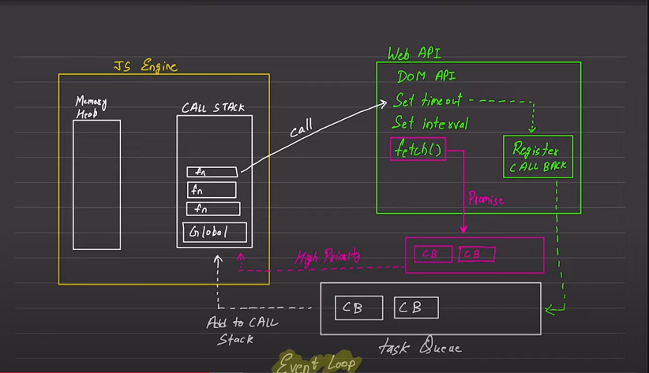

#Async Javascript fundamentals
## What is async?
- Async is a short form of Asynchronous. It means that the code will not run in a sequence. It will run in a parallel way.
- In the async code, the code will not wait for the previous code to be executed. It will execute the code in a parallel way.

## What is the use of async?
- The main use of async is to make the code run in a parallel way. It will not wait for the previous code to be executed.

## What is synchronous code?
- Synchronous code is the code that will run in a sequence. It will wait for the previous code to be executed.
- By default, the javascript code is synchronous and single-threaded. It means that the code will run in a sequence and it will wait for the previous code to be executed. The execution of the code will be done in a single thread. Execute one line of code at a time. 

## Call Stack:

The call stack is a mechanism that JavaScript interpreters use to keep track of function calls in your program. When a function is called, a new frame is pushed onto the top of the stack. This frame contains information about the function call, including the function's arguments and local variables. When the function returns, its frame is popped off the stack, and control returns to the function that was called previously (which is now at the top of the stack). If the stack is full and a new frame needs to be added (because a function was called), a "stack overflow" error occurs.

## Memory Heap:

The memory heap is where JavaScript stores objects. When you create an object, a block of memory is allocated in the heap to store the object. This memory can be freed when the object is no longer needed (i.e., there are no more references to it). In JavaScript, this is done automatically by the garbage collector. The garbage collector finds objects that are no longer reachable and frees the memory occupied by them. However, if the garbage collector cannot free memory fast enough, or if the heap is full and a new object needs to be added, an "out of memory" error occurs.

*In summary, the call stack and memory heap are two key components of JavaScript's execution model. The call stack keeps track of function calls, while the memory heap stores objects. Understanding how they work can help you write more efficient and error-free code.* 

# Blocking code vs Non-blocking code

- Blocking code is the code that will block the execution of the code. It will wait for the previous code to be executed.

- Non-blocking code is the code that will not block the execution of the code. It will not wait for the previous code to be executed.

